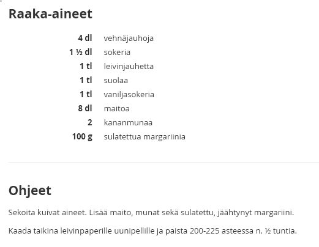
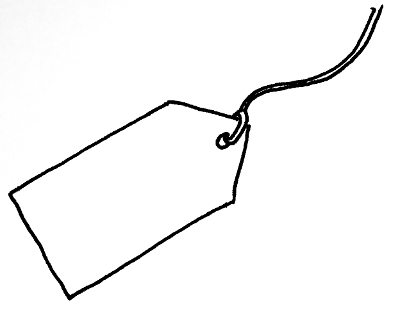
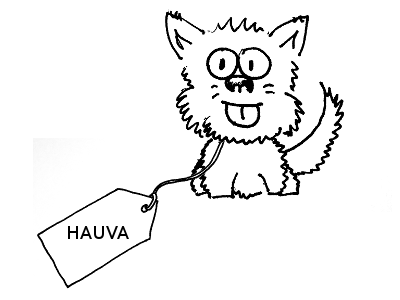
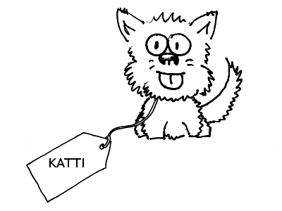

# Koodikoulu

Tervetuloa koodikouluun!

---

## Opet

* Jani Kaarela
* Katja Mankinen
* Niko Viik

---

## Ohjelmat ja ohjelmointi

* mikä on ohjelma ja ohjelmakoodi?
* missä kaikkialla on ohjelmia?
* mitä ohjelmilla voi tehdä?
* mikä on ohjelmointikieli, mitä ohjelmointikieliä on?
* ketkä niitä ohjelmia oikein kirjoittavat?

---



---

## Muuttujat

Muuttujaan voidaan säilöä erilaista tietoa: tekstiä, numeroita tai
monimutkaisempia tietorakenteita. 
```
var nimi = "Aku Ankka";
```

Kuten nimi antaa ymmärtää, muuttuja voi muuttua - sen voi asettaa sisältämään jonkin toisen arvon. Muuttujalla ei Javascriptissä ole tiettyä pysyvää tyyppiä, vaan sen arvoksi voidaan esimerkiksi ensin antaa tekstiä ja myöhemmin numero.

---

Muuttujaa voi ajatella nimilappuna, joka on kiinnitetty narulla arvoon,
johon haluaa viitata nimellä:


Lapusta vetämällä saat käsiisi arvon, johon sillä viitataan.

---

```
var hauva = new Koira();
```



---

```
var katti = hauva; // oho?
```



---

## Operaattorit

Muuttujia käsitellään operaattoreilla. Edellä yhtäsuuruusmerkillä asetettiin muuttujalle arvo. Operaattoreita löytyy mm. yhteen-, vähennys-, kerto- ja jakolaskuun, sekä vertailuun. Suuri osa operaattoreista toimii vain tietyn tyyppisille muuttujille.

```
var kaksi = 1 + 1; // 2
var tuplanimi = nimi + nimi; // "Aku AnkkaAku Ankka"
```

---

## Ehtolauseet

Ehtolauseen avulla suoritetaan koodia vain, jos jokin ehto on tosi (_true_) - sen ollessa epätosi (_false_), koodia ei suoriteta. Esimerkiksi:

```
if (nimi == "Aku Ankka") {
  console.log("Kääk maailma!");
} else {
  console.log("Hei maailma!");
}
```

Konsoliin lokitetaan "Kääk maailma!" vain siinä tapauksessa, että muuttuja "nimi" on arvoltaan "Aku Ankka". Muuten lokitetaan "Hei maailma!".

---

## Toistolauseet

Myös toistolauseessa on ehto, ja sen ollessa tosi, koodi suoritetaan. Erona on, että koodi suoritetaan toistuvasti, kunnes ehdosta tulee epätosi. Onkin tärkeätä, että ehto muuttuu jossain vaiheessa epätodeksi - muuten koodi juuttuu ikuiseen toistoon (_infinite loop_).

```
var i = 0;
while (i < 5) { // toistetaan niin kauan, kuin i on alle 5!
  i = i + 1;
}
```

---

## Funktiot

Funktio on nimetty koodilohko, joka voi ottaa syötteekseen parametreja ja palauttaa paluuarvon. Funktio suoritetaan vasta, kun sitä kutsutaan.

```
function plus(eka, toka) {
  return eka + toka;
}
```

Funktio "plus" ottaa parametrit "eka" ja "toka", ja palauttaa niiden summan (mikäli ne ovat numeroita) tai liittää ne yhteen (mikäli ne ovat tekstiä).


